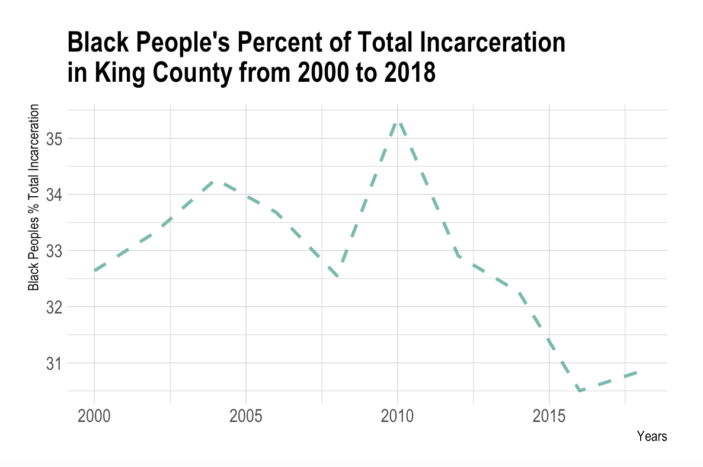
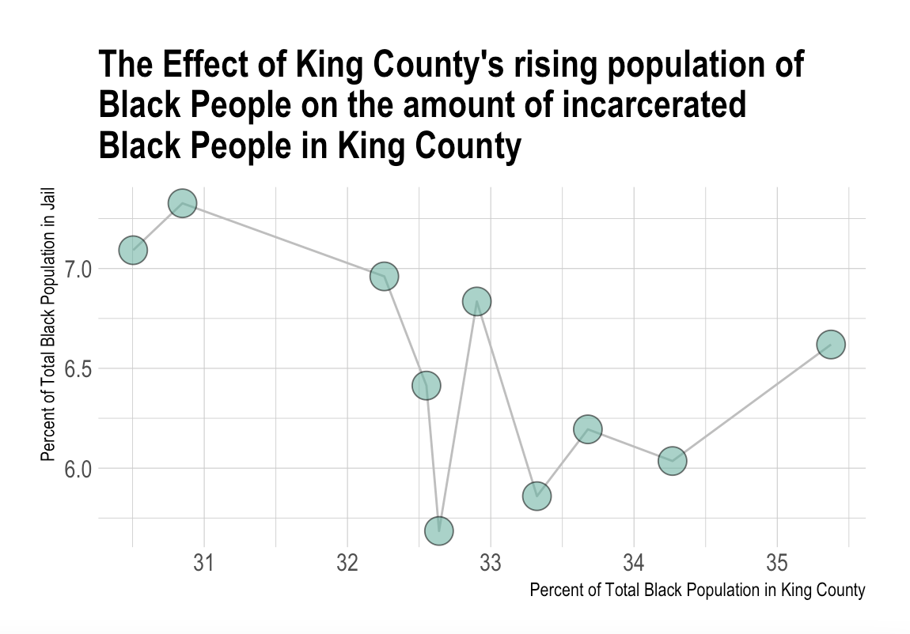

---
### Introduction
Racism has plagued America for centuries and this is very clearly when looking at the prison system. Generational racism, the war on drugs, over policing, and our desperate need for police reform have led to the disproportionate incarceration of people of color. Throughout the United States, Black Americans are incarcerated at a massively higher rate than other races. I've chosen to take a closer look at the incarceration rates of Black Americans in comparison to other races with a focus in Washington and King county. I have lived in Seattle my whole life so I am interested to learn more about Washington's current prison system and our prison systems past. Total jail population in this dataset is the average daily number of people held in jail through December 31 of a given year. 

I wanted to focus on the State of Washington so I found that the County in Washington with the highest total jail population in 2018 was King County with 3060 people. The County in Washington with the lowest total jail population in 2018 was Garfield and Columbia with 7 people. In 2018, the Largest population of black people lived in King County with 3060 people. The Washington Counties with the lowest population of black people in 2018 was Adams, Garfeild, Pend Oreille, Wahkiakum because they all had 0. The race with the most incarceration in 2018 in King County was white people with 1565.32 people. The race with the most incarceration in 1991 in King County was white people with 1137.79 people.

### Chart 1: Trend over time
This graph is a line plot that follows the trend over time of how many of the total incarceration people are black. I calculated this by using the merge function to create a column that output the percentage of the population in jail that are black. The math I did during the mergue function was dividing the black_jail_pop by the total_jail_pop and multiplying by 100. When looking at the line graph below, you can see that there hasn't been much of a change in black people's percentage of total incarceration. There was a little spike in 2010 and it has been decreasing ever since. I know from other research that black people's total population has increased in King County over the past 20 years though, so it is surprising to me that the chart didn't show a constant/steady increase.  

### Chart 2: Variable Comparison Chart
This chart is a connected scatterplot that analyzes the relationship between the population of black people in King County and how many of the total incarcerated people are black. I used ratios to compare this data so that I can fairly compare the data points together other and not have to worry about taking into account the population of King County growing in general. So I compared the percentage of Black people in all of King County's Total Population to the percent of black people who incarcerated. I found though looking at the general flow of the chart that generally as the percent of the black population rises in King County, the percent of the black population in jails is decreasing.

### Chart 3: Map
This chart is a map of Washington and it compares the percent of black people of the county's total population in jail in 2018. I wanted to see how the percentage differed around the state. Using a map with color and having the darker the shade the higher the percentage would have been a very clear way to show this. I was able to make lots of different maps but for some reason I was have trouble with adding my data into it. I added a picture of one of the maps I made but it the  data won't input it. I have lots of code in the analysis file that should some of the many ways I tried to get the map to work. 

---
